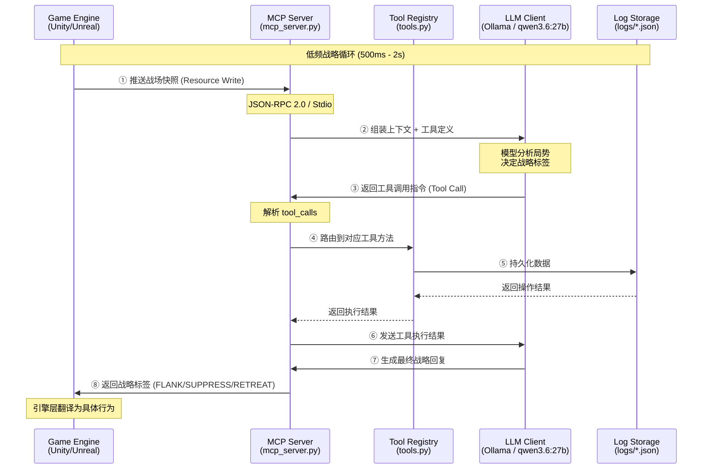
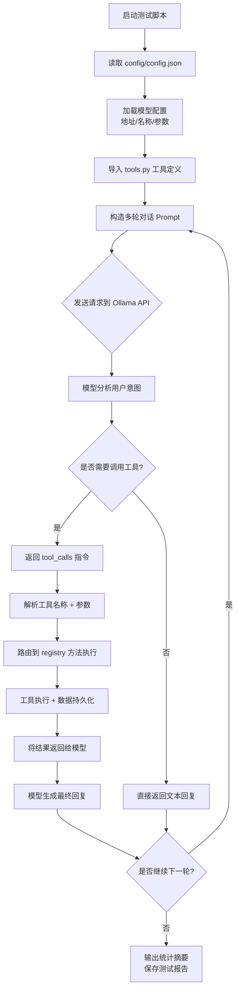
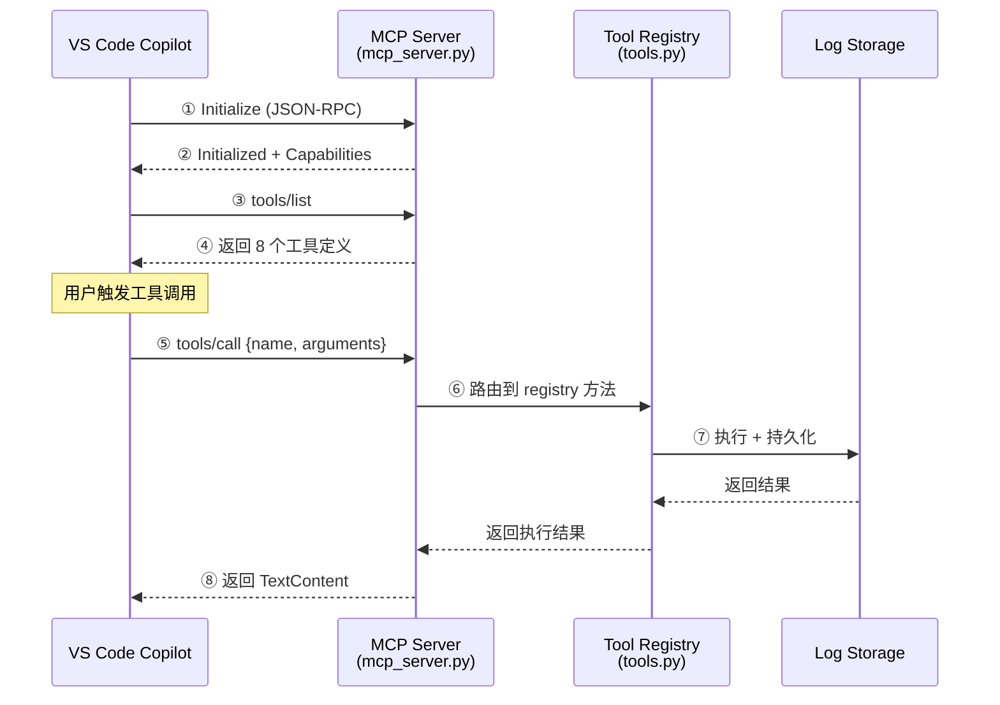

# FPS Tactical MCP — 数据流与执行流程

> 本文档描述从游戏引擎到 LLM 战略大脑的完整数据流，以及当前测试阶段的执行流程。

---

## 📊 全局数据流架构



---

## 🎮 目标架构：游戏引擎集成流程

### 频率分层设计

| 层级 | 频率 | 延迟预算 | 负责方 | 任务 |
|------|------|---------|--------|------|
| **微操层** | 50-1000 Hz | < 20ms | Game Engine | 寻路、控枪、开火、动画混合 |
| **战术层** | 0.5-2 Hz | 500-2000ms | LLM via MCP | 绕后/压制/撤退/集火决策 |
| **战略层** | 0.1-0.5 Hz | 2-5s | LLM via MCP | 资源分配、目标优先级、阵型变换 |

### 战场快照推送流程

```
┌─────────────────────────────────────────────────────────────────┐
│  ① Engine 每 500-2000ms 采集战场状态                            │
│                                                                 │
│     {                                                            │
│       "timestamp": "2026-06-11T14:32:15.123Z",                  │
│       "team": "alpha",                                           │
│       "players": [{id, position, health, ammo, weapon, ...}],   │
│       "enemies": [{id, position, threat_level, ...}],           │
│       "audio_clues": [{type, direction, distance, ...}]         │
│     }                                                            │
│                                                                 │
│  ↓                                                               │
│  ② 通过 MCP Resource Write 写入 mcp://fps-tactical/battle/snapshot │
│                                                                 │
│  ↓                                                               │
│  ③ MCP Server 接收快照，组装 Prompt + Tools 定义 → 发送给 LLM     │
│                                                                 │
│  ↓                                                               │
│  ④ LLM 分析局势 → 调用工具返回战略标签                            │
│                                                                 │
│     { "primary": "FLANK", "direction": "east",                   │
│       "confidence": 0.92, "reasoning": "..." }                   │
│                                                                 │
│  ↓                                                               │
│  ⑤ MCP Server 将战略标签写回 → Engine 执行层翻译为具体行为         │
│                                                                 │
│     FLANK+EAST → 寻路到东侧掩体 → 接近至 15m → 开火               │
└─────────────────────────────────────────────────────────────────┘
```

---

## 🧪 当前阶段：测试流程详解

### 测试脚本执行流程

**入口：** `test_function_calling.py`



### 单轮请求详细步骤

#### 第 1 步：构造请求 Payload

**文件：** `test_function_calling.py` → `_send_request()`

```python
# 从 config.json 读取模型配置
config = {
    "api_url": "http://100.64.0.13:11438",
    "default_model": "qwen3.6:27b"
}

# 构造请求
payload = {
    "model": "qwen3.6:27b",
    "messages": [
        {
            "role": "user",
            "content": "请保存一条数据到日志，分类是test，数据是{hello: world}"
        }
    ],
    "tools": [TOOL_SAVE_DATA, TOOL_QUERY_LOGS, ...],  # 所有工具定义
    "stream": True  # 流式输出
}
```

**关键点：**
- 所有工具的 JSON Schema 定义一起发送给模型
- 模型通过 `description` 理解每个工具的用途
- 模型通过 `parameters` 知道需要提供什么参数

---

#### 第 2 步：模型分析 + 工具调用决策

**Ollama 返回的响应（需要工具时）：**

```json
{
    "message": {
        "role": "assistant",
        "tool_calls": [
            {
                "id": "call_123",
                "function": {
                    "name": "save_data_to_log",
                    "arguments": {
                        "category": "test",
                        "data": {"hello": "world"},
                        "priority": "medium"
                    }
                }
            }
        ]
    }
}
```

**决策逻辑：**
1. 模型阅读用户 Prompt，理解意图
2. 对比可用工具列表，判断是否需要工具辅助
3. 从 Prompt 中提取参数，填充到工具的 `arguments`
4. 返回 `tool_calls` 指令（或直接返回文本，如果不需要工具）

---

#### 第 3 步：工具执行路由

**文件：** `test_function_calling.py` → `_execute_tool()`

```python
def _execute_tool(self, tool_call: Dict):
    # 1. 提取工具名称和参数
    func_name = tool_call["function"]["name"]        # "save_data_to_log"
    arguments = tool_call["function"]["arguments"]   # {"category": "test", ...}
    
    # 2. 路由到对应的 registry 方法
    tool_func = getattr(registry, func_name, None)
    if tool_func:
        result = tool_func(**arguments)
    
    # 3. 返回执行结果
    return {"status": "success", "result": result}
```

**路由表：**

| 工具名称 | registry 方法 | 功能 |
|-----------|-------------|------|
| `save_data_to_log` | `registry.save_data_to_log()` | 保存数据到日志文件 |
| `query_logs` | `registry.query_logs()` | 查询已保存的日志 |
| `get_test_statistics` | `registry.get_test_statistics()` | 获取调用统计信息 |
| `show_popup` | `registry.show_popup()` | 弹出 Windows 消息框 |
| `test_recall` | `registry.test_recall()` | 验证 Function Calling 功能 |
| `calculate` | `registry.calculate()` | 执行数学计算 |
| `get_local_time` | `registry.get_local_time()` | 获取当前系统时间 |
| `get_self_info` | `registry.get_self_info()` | 获取当前模型配置信息 |

---

#### 第 4 步：结果反馈 + 多轮对话

```python
# 构造多轮对话上下文
messages = [
    {"role": "user", "content": "请保存一条数据..."},           # 用户原始请求
    {"role": "assistant", "tool_calls": [...]},                 # 模型的工具调用指令
    {"role": "tool", "content": '{"status": "success", ...}'}   # 工具执行结果
]

# 再次发送给模型，让模型基于工具结果生成最终回复
response = requests.post("/api/chat", json={"messages": messages})
```

**关键点：**
- 工具执行结果以 `role: "tool"` 的形式返回给模型
- 模型收到结果后，可以生成自然语言回复
- 例如："数据已成功保存到日志文件，记录ID为123"

---

## 🔌 MCP 服务器通信流程

### VS Code Copilot 集成

**文件：** `mcp_server.py` + `.vscode/settings.json`



### JSON-RPC 2.0 通信示例

```jsonc
// ① VS Code → MCP Server: 列出可用工具
{
  "jsonrpc": "2.0",
  "id": 1,
  "method": "tools/list",
  "params": {}
}

// ② MCP Server → VS Code: 返回工具列表
{
  "jsonrpc": "2.0",
  "id": 1,
  "result": {
    "tools": [
      {
        "name": "save_data_to_log",
        "description": "将指定的数据保存到本地日志文件中...",
        "inputSchema": { "type": "object", "properties": { ... } }
      },
      // ... 其他 7 个工具
    ]
  }
}

// ③ VS Code → MCP Server: 调用工具
{
  "jsonrpc": "2.0",
  "id": 2,
  "method": "tools/call",
  "params": {
    "name": "save_data_to_log",
    "arguments": {
      "category": "battle_snapshot",
      "data": { "enemy_count": 3, "team_health": 78 },
      "priority": "high"
    }
  }
}

// ④ MCP Server → VS Code: 返回执行结果
{
  "jsonrpc": "2.0",
  "id": 2,
  "result": {
    "content": [
      {
        "type": "text",
        "text": "{\"status\": \"success\", \"record_id\": 123}"
      }
    ]
  }
}
```

---

## 📁 文件职责矩阵

| 文件 | 角色 | 协议层 |
|-------|------|-------|
| `tools.py` | 工具定义 (JSON Schema) + 工具实现 | Application |
| `mcp_server.py` | MCP 服务器，暴露工具给外部客户端 | Transport (JSON-RPC 2.0) |
| `test_function_calling.py` | 直接调用 Ollama API 的测试脚本 | HTTP (Ollama API) |
| `config/config.json` | 模型配置 (地址/名称/参数) | Configuration |
| `logs/tool_call_history.json` | 工具调用产生的数据文件 | Storage |
| `.vscode/settings.json` | VS Code MCP 服务器注册配置 | Integration |

---

## 🔄 完整数据流总结

### 测试模式 (当前)

```
用户输入 → test_function_calling.py → Ollama API → 模型分析
    → 返回 tool_calls → 路由到 registry → 执行工具
    → 结果返回模型 → 生成最终回复 → 输出到终端
```

### MCP 模式 (已实现)

```
VS Code Copilot → MCP Server (stdio) → tools/list
    → 用户触发调用 → tools/call → registry 路由
    → 执行工具 → 返回 TextContent → Copilot 展示结果
```

### 游戏集成模式 (目标)

```
Game Engine → 采集战场快照 → MCP Resource Write
    → MCP Server → 组装 Prompt → LLM Client
    → 战略分析 → 调用工具 → 返回战略标签
    → MCP Server → Engine 执行层 → 翻译为具体行为
```

---

## ⚡ 核心概念

1. **工具定义 (Schema)**：JSON Schema 描述工具能力，模型据此理解可用工具
2. **工具调用 (Calling)**：模型自主决策调用哪个工具、传什么参数
3. **工具执行 (Execution)**：`ToolRegistry` 路由分发，实际执行 Python 函数
4. **结果反馈 (Feedback)**：执行结果返回模型，模型生成自然语言回复
5. **MCP 协议 (Protocol)**：JSON-RPC 2.0 标准化通信，解耦引擎与 AI 服务
6. **频率分层 (Layering)**：微操层高频低延迟，战略层低频高智能，各司其职
