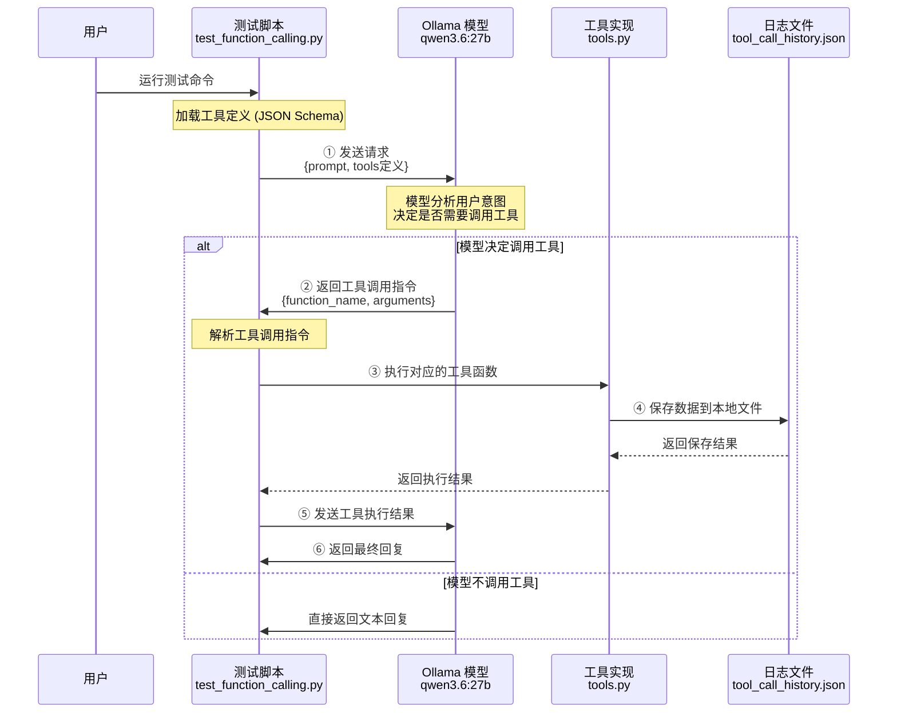

# Function Calling 完整流程解析

## 📊 整体架构图



---

## 🔍 分步详解

### 第 1 步：定义工具（JSON Schema）

**文件：** `tools.py`

```python
# 工具1的定义（告诉模型这个工具能做什么）
TOOL_SAVE_DATA = {
    "type": "function",
    "function": {
        "name": "save_data_to_log",           # 工具名称
        "description": "将数据保存到本地日志",  # 工具描述（模型靠这个理解用途）
        "parameters": {                       # 参数定义（告诉模型需要什么参数）
            "type": "object",
            "properties": {
                "category": {
                    "type": "string",
                    "description": "数据分类"
                },
                "data": {
                    "type": "object",
                    "description": "要保存的数据"
                },
                "priority": {
                    "type": "string",
                    "enum": ["low", "medium", "high"]
                }
            },
            "required": ["category", "data"]  # 必填参数
        }
    }
}
```

**关键点：**
- 这是 **JSON Schema** 格式，是 OpenAI/Ollama 标准
- 模型通过 `description` 理解工具用途
- 模型通过 `parameters` 知道需要提供什么参数

---

### 第 2 步：实现工具函数

**文件：** `tools.py`

```python
class ToolRegistry:
    """工具注册中心"""
    
    def save_data_to_log(self, category: str, data: Dict, priority: str = "medium"):
        """
        这个函数的名称必须和 JSON Schema 中的 name 一致
        """
        # 1. 创建记录
        record = {
            "timestamp": datetime.now().isoformat(),
            "category": category,
            "data": data,
            "priority": priority
        }
        
        # 2. 保存到内存
        self.call_history.append(record)
        
        # 3. 保存到文件
        with open("logs/tool_call_history.json", 'w') as f:
            json.dump(self.call_history, f)
        
        # 4. 返回结果（会传回给模型）
        return {"status": "success", "record_id": 123}
```

**关键点：**
- 函数名必须和 Schema 中的 `name` 一致
- 返回值会传回给模型，让模型知道工具执行结果

---

### 第 3 步：发送请求给模型

**文件：** `test_function_calling.py` → `_send_request()`

```python
# 构造请求 payload
payload = {
    "model": "qwen3.6:27b",
    "messages": [
        {
            "role": "user",
            "content": "请保存一条数据到日志，分类是test，数据是{hello: world}"
        }
    ],
    "tools": [TOOL_SAVE_DATA, TOOL_QUERY_LOGS, TOOL_GET_STATS],  # 传入所有工具定义
    "stream": False
}

# 发送到 Ollama API
response = requests.post(
    "http://100.64.0.13:11438/api/chat",
    json=payload
)
```

**关键点：**
- 把**所有工具的定义**一起发给模型
- 模型会阅读每个工具的 description，判断是否需要调用

---

### 第 4 步：模型决定调用工具

**Ollama 返回的响应：**

```json
{
    "message": {
        "role": "assistant",
        "tool_calls": [
            {
                "id": "call_123",
                "function": {
                    "name": "save_data_to_log",
                    "arguments": {
                        "category": "test",
                        "data": {"hello": "world"},
                        "priority": "medium"
                    }
                }
            }
        ]
    }
}
```

**关键点：**
- 模型**自动**从用户提示词中提取参数
- 模型决定调用哪个工具、传什么参数
- 如果模型认为不需要工具，就不会有 `tool_calls` 字段

---

### 第 5 步：执行工具调用

**文件：** `test_function_calling.py` → `_execute_tool()`

```python
def _execute_tool(self, tool_call: Dict):
    # 1. 提取工具名称和参数
    func_name = tool_call["function"]["name"]        # "save_data_to_log"
    arguments = tool_call["function"]["arguments"]   # {"category": "test", ...}
    
    # 2. 根据名称调用对应的 Python 函数
    if func_name == "save_data_to_log":
        result = registry.save_data_to_log(
            category=arguments["category"],
            data=arguments["data"],
            priority=arguments.get("priority", "medium")
        )
    
    # 3. 返回结果
    return {"status": "success", "result": result}
```

**关键点：**
- 这是一个**路由分发**的过程
- 根据模型返回的工具名称，调用对应的 Python 函数
- 执行结果会返回给模型

---

### 第 6 步：将结果返回给模型（可选）

**文件：** `test_function_calling.py` → `_send_follow_up()`

```python
# 构造多轮对话
messages = [
    {"role": "user", "content": "请保存一条数据..."},           # 用户原始请求
    {"role": "assistant", "tool_calls": [...]},                 # 模型的工具调用指令
    {"role": "tool", "content": '{"status": "success", ...}'}   # 工具执行结果
]

# 再次发送给模型
response = requests.post("/api/chat", json={"messages": messages})
```

**关键点：**
- 模型收到工具执行结果后，可以生成最终回复
- 例如："数据已成功保存到日志文件，记录ID为123"

---

## 🔄 完整数据流

```
用户输入: "保存一条数据，分类是test，内容是hello=world"
    ↓
[测试脚本] 构造请求 {prompt, tools定义}
    ↓
[Ollama API] POST /api/chat
    ↓
[模型] 分析意图 → 决定调用 save_data_to_log
    ↓
[模型] 提取参数 {category:"test", data:{hello:"world"}}
    ↓
[模型] 返回工具调用指令
    ↓
[测试脚本] 解析指令 → 调用 registry.save_data_to_log()
    ↓
[工具函数] 写入 logs/tool_call_history.json
    ↓
[工具函数] 返回 {"status": "success", "record_id": 1}
    ↓
[测试脚本] 将结果返回给模型
    ↓
[模型] 生成最终回复: "数据已保存，记录ID为1"
```

---

## 📁 涉及的文件

| 文件 | 角色 |
|------|------|
| `tools.py` | 定义工具 Schema + 实现工具函数 |
| `test_function_calling.py` | 测试脚本，负责与 Ollama 通信和执行工具 |
| `config/config.json` | 配置模型地址和名称 |
| `logs/tool_call_history.json` | 工具调用产生的数据文件 |
| `logs/tool_calls.log` | 工具调用的日志文件 |

---

## 💡 核心概念总结

1. **工具定义（Schema）**：告诉模型"有什么工具可用"
2. **工具调用（Calling）**：模型决定"用哪个工具、传什么参数"
3. **工具执行（Execution）**：程序实际执行工具函数
4. **结果反馈（Feedback）**：将执行结果返回给模型

这就是完整的 Function Calling 流程！
